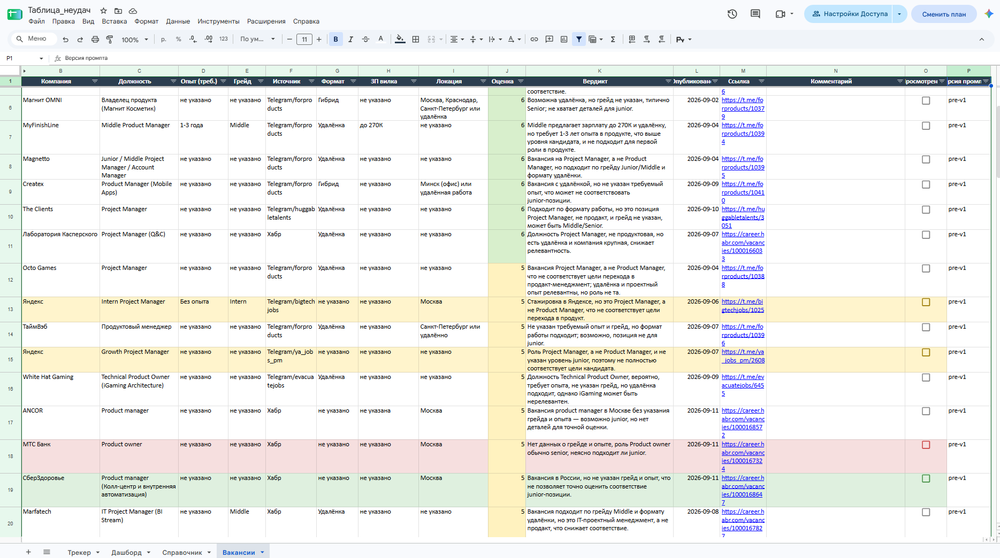
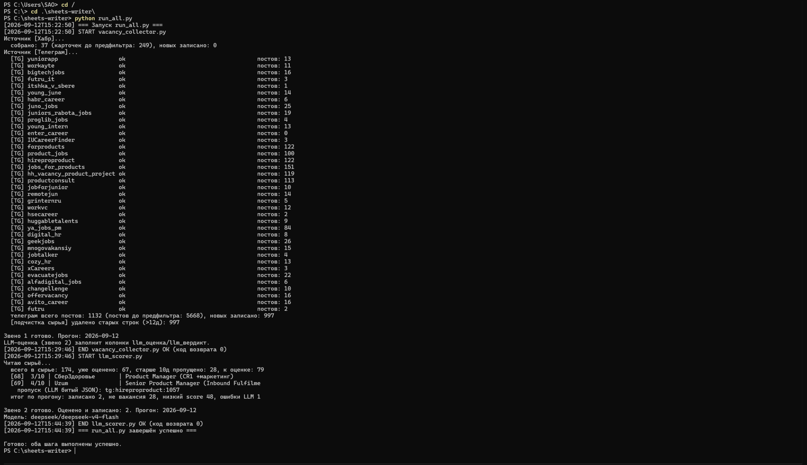

# Новая вакансия подъехала

Мой личный агент: сам находит стажировки и junior-вакансии в продукте, отсеивает лишнее и присылает в телеграм только то, что реально стоит открыть.

Собирает вакансии с Хабра и телеграм-каналов дважды в сутки, прогоняет через нейросеть, складывает в таблицу и пингует меня. Всё крутится в облаке само, компьютер включать не нужно.



## Проблема

Искать первую роль в продукте - это подписаться на кучу каналов и постоянно высматривать в них своё. Неудобно: телеграм захламляется вакансиями, поток идёт вперемешку, и почти всё в нём - не твоё. Senior-позиции, вакансии не про продукт, реклама курсов.

- **Где вообще смотреть?** hh.ru закрыл соискательский API - официально «поддержка прекращена 15 декабря 2025», по факту доступ отвалился весной 2026. Остались агрегаторы в телеграме и career-площадки.
- **Как отличить своё от чужого?** мне, junior, не нужны Middle и Senior, но в ленте они вперемешку с подходящим, и глазами это разгребать долго.
- **Одно и то же по пять раз.** каналы репостят друг друга, и одна вакансия прилетает из кучи мест.

## Как это работает

Коротко: собрал → нейросеть оценила → сложил в таблицу → прислал в телеграм. И так каждые 12 часов, само.

```
Откуда беру
  ├── Хабр Карьера
  └── 38 телеграм-каналов
        │
        v
Собираю ─────── выкидываю явно не то, склеиваю повторы,
  │             отбрасываю всё старше 10 дней
  v
Оценивает нейросеть ── ставит балл 0-10 и пишет вердикт,
  │                     почему подходит или нет
  v
Таблица ─────── что прошло по баллу - падает сюда,
  │             отсортировано, лучшее сверху
  v
Телеграм ────── счётчик + топ подходящих (должность кликабельна)
```

Всё это запускается по расписанию само - через GitHub Actions, дважды в день.

Так выглядит живой прогон (запустил вручную вскоре после автоматического - потому новых мало, основное собралось утром):



## Что внутри интереснее всего

**Оценивает нейросеть, а не поиск по словам.** Я скармливаю ей текст вакансии и говорю, кто я: junior, перехожу в продукт. Она ставит балл и коротко объясняет решение. Обычный поиск по словам «product manager» притащил бы и Senior, и Project Manager - а нейросеть понимает, что Senior мне сейчас не по грейду, и честно ставит низкий балл с пояснением.

**Мусор не доходит до таблицы.** В таблицу попадает только то, что набрало 3 балла и выше. Порог подобрал по живым данным: всё, что ниже, стабильно оказывалось «не продукт» или явный Senior. Смысл простой - если в списке три четверти шума, ты его просто перестаёшь открывать.

Масштаб отсева видно на одном прогоне: собралось больше тысячи постов, из них почти тысяча - старше 10 дней и сразу в топку, до оценки нейросетью доходит несколько десятков свежих, а в таблицу падают единицы по-настоящему подходящих. Бот прожёвывает эту тысячу за меня - я открываю только то, что осталось.

**Повторы не задваиваются.** У каждой вакансии есть невидимая метка-отпечаток. Каналы могут репостить один и тот же пост хоть десять раз - с такой меткой он запишется только однажды. Между заходами (а бот просыпается дважды в сутки) прошлые вакансии тоже помнятся: перемолоть больше тысячи постов и не записать ни одного повтора - обычный прогон.

**Нейросеть иногда капризничает - научил не спотыкаться.** Дешёвая модель любит «поразмышлять вслух» вместо того чтобы просто ответить, и от этого ломается. Лечится не повторами, а одной настройкой: «думай про себя, мне отдавай только ответ». Отдельно есть повтор на случай, если интернет моргнул.

**Таблица сама себя чистит.** Вакансии старше 10 дней уезжают из таблицы каждый прогон - они уже протухли. Специально не стал ставить жёсткий лимит «не больше N строк»: удалишь свежую - а она на следующем заходе вернётся как «новая», и получится вечная карусель. Чищу только по возрасту.

**Уведомление, из которого сразу видно суть.** Раньше бот присылал только счётчик - «новых N», и всё равно приходилось лезть в таблицу. Теперь в сообщение попадает топ самых подходящих: должность кликабельной ссылкой, компания, формат, город. Открываю вакансию прямо из телеграма, в таблицу - только если хочу копнуть глубже. Порог для показа в уведомлении выше, чем для попадания в таблицу: в таблицу идёт всё годное, в пуш - только явно моё, чтобы сообщение не превращалось в простыню. Пишет и когда не нашёл ничего нового - короткое «пока тишина». Так я вижу, что бот отработал и жив, а не завис молча.

**Ключи и доступы - подальше от чужих глаз.** У бота есть ключ к нейросети, токен телеграм-бота и доступ к моим таблицам - попади это к постороннему, он получит и мой доступ, и мои деньги на счету нейросети. Поэтому ничего этого нет в коде: секреты лежат отдельно (локально в файле, который не уходит в общий доступ, в облаке - в защищённом хранилище GitHub), а в самом коде только их названия, не значения. Один раз, разбирая задачу с ИИ по скриншотам, я не заметил, что в кадр попал токен бота, в итоге отозвал его и выпустил новый. Лучше сразу в себе воспитывать безопасность, как будто и ИИ не стоит доверять.

## Почему нейросеть, а не просто фильтр по словам

Можно было отфильтровать по ключевым словам - дёшево и без всяких нейросетей. Но подходит вакансия или нет - это не список слов. «Product Manager, опыт 1-3 года» по названию вроде моё, а по сути уже нет. Нейросеть читает требования целиком и отвечает на вопрос «а этому конкретному человеку оно подходит?», а не «есть ли в тексте нужное слово».

Проверил, что оценивает честно: вакансии, которые она забраковала низким баллом, я перепроверил руками - и правда не для junior, везде опыт от года-двух или Senior. Годное в отсев не улетает.

## На чём собрано

Python, нейросеть через OpenRouter, Google Таблицы, запуск по расписанию через GitHub Actions, уведомления через телеграм-бота.

## Решения и почему так

| Решение | Как ещё можно было | Почему выбрал это |
|---|---|---|
| Оценка нейросетью | Фильтр по словам | Слова не отличают junior-вакансию от Senior с тем же названием |
| Порог по баллу на входе | Писать всё, фильтровать глазами | Список, где три четверти - шум, перестаёшь открывать |
| Google Таблица как экран | База данных + сайт | Ноль возни: открыл ссылку, галочкой отметил просмотренное |
| Отпечаток вакансии | Сверять по тексту | Отпечаток не врёт, а текст репоста может чуть отличаться |
| «Думай про себя» | Переспрашивать при сбое | Упрямая модель спотыкается на том же месте; дело в формате, не в сети |
| Чистка по возрасту | Лимит «не больше N» | Лимит рождает карусель: удалил свежее - вернётся как новое |
| Дешёвая модель | Дорогая топовая | На потоке в сотни вакансий разница в качестве не стоит цены |
| Топ в уведомление, остальное в таблицу | Слать все новые в пуш | Пуш из 15 вакансий не читается; в сообщение - только явно моё |

## Как это делалось

Код писал в связке с ИИ - без него на реализацию ушли бы недели. Но
инструмент не отменяет мышления: почти всё время заняла не сборка, а
отладка - и находить настоящую причину бага, а не симптом, приходилось
самому. Главный урок проекта короткий: пользуйся ИИ, но не выключай
критическое мышление и умей думать сам.

## Автор

Андрей · Телеграм: [@Aysvoch](https://t.me/Aysvoch) · Канал: [Приватный эфир](https://t.me/Private_ether)
